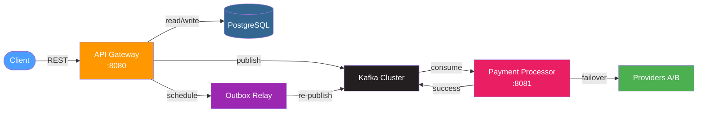
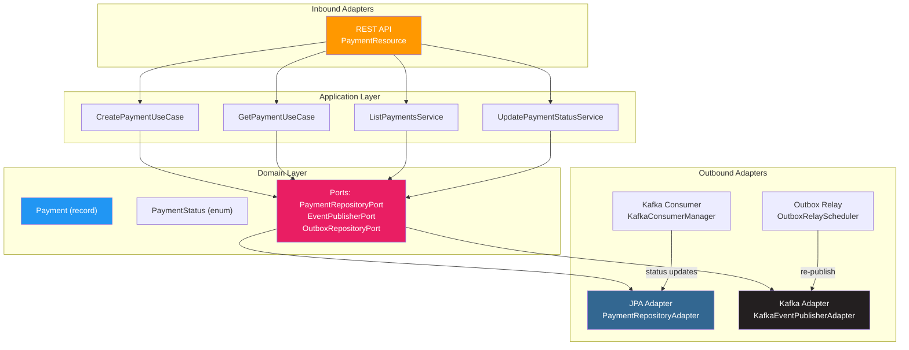
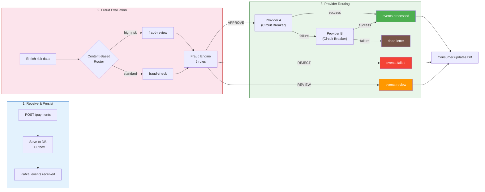
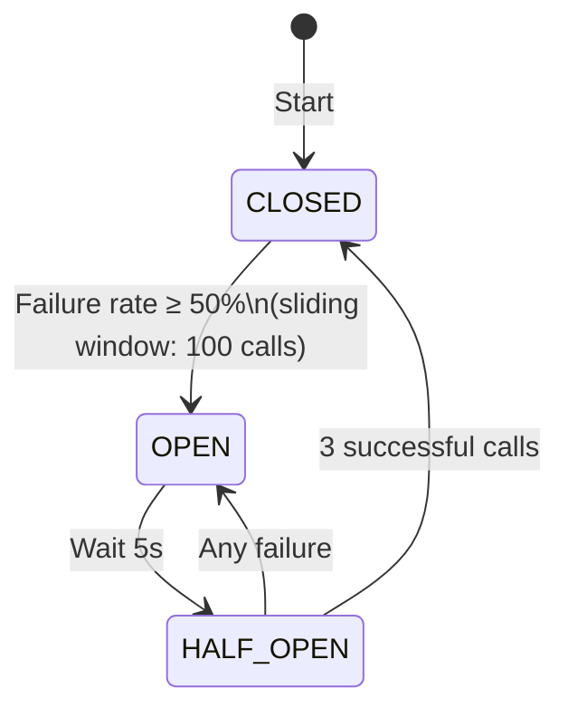
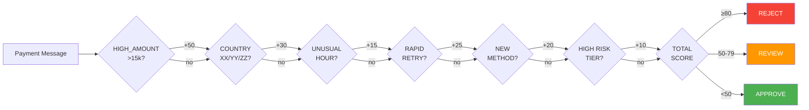

<div align="center">

# Payment Orchestration Layer

[](https://openjdk.org/projects/jdk/17/)
[](https://quarkus.io/)
[](https://camel.apache.org/)
[](https://kafka.apache.org/)
[](https://kubernetes.io/)
[](LICENSE)
[](#-testing)

A proof-of-concept **Payment Orchestration Layer** built with Apache Camel, Quarkus, and Kafka — demonstrating event-driven architecture, fraud detection, circuit breaker patterns, provider failover, and Kubernetes-native deployment.

---

[📋 Disclaimer](#-disclaimer) · [🚀 Why This Stack?](#-why-this-stack) · [🏗️ Architecture](#%EF%B8%8F-architecture) · [✨ Features](#-features) · [📡 API Reference](#-api-reference) · [⚙️ Configuration](#%EF%B8%8F-configuration) · [🏁 Quick Start](#-quick-start) · [🧪 Testing](#-testing) · [📁 Project Structure](#-project-structure) · [🔒 Security](#-security) · [📐 ADRs](#-architecture-decision-records-adrs)

</div>

---

## 📋 Disclaimer

This project is developed for **educational and research purposes** only. It is intended to provide hands-on experience and deepen knowledge in **event-driven architecture**, **enterprise integration patterns**, and **payment processing orchestration**. It is **not designed** for deployment in production environments or real-world payment systems.

The fraud detection engine uses simulated risk data. In production, this would be replaced with real risk scoring services, KYC providers, and regulatory compliance systems.

---

## 🚀 Why This Stack?

### ☕ Why Java 17?

Java 17 LTS provides modern language features that significantly improve code quality and reduce boilerplate:

| Feature | Usage in this POC | Benefit |
|---------|-------------------|---------|
| **Records** | `PaymentRequest`, `PaymentResponse`, `PaymentMessage`, `FraudResult` | Immutable DTOs without boilerplate constructors, getters, equals, hashCode |
| **Sealed Interfaces** | `FraudResult` with `Approve`, `Review`, `Reject` permits | Type-safe fraud outcomes with exhaustive switch expressions |
| **Pattern Matching** | `instanceof` in exception mappers | Cleaner exception handling without explicit casts |
| **Switch Expressions** | `PaymentEnrichProcessor` risk tier selection | Expression-based switching with arrow syntax |
| **Text Blocks** | Test JSON payloads | Multi-line strings without concatenation |

### ⚡ Why Quarkus?

Quarkus is a cloud-native Java framework designed for container-first deployment:

- **Developer Experience**: Live coding, fast startup (~30s), hot reload
- **Cloud-Native**: Kubernetes-native with built-in health checks, metrics, OpenAPI
- **MicroProfile**: Standards-based Health, OpenAPI, Config, Metrics via SmallRye
- **Camel Integration**: First-class Apache Camel support via Camel Quarkus
- **GraalVM Ready**: Native compilation for instant startup (not used in this POC)

### 🐪 Why Apache Camel?

Apache Camel provides Enterprise Integration Patterns (EIP) out of the box:

- **Content-Based Router**: Route payments to fraud-check vs fraud-review based on amount, payment method, and country
- **Wire Tap**: Non-blocking parallel audit logging without affecting the main flow
- **Circuit Breaker**: Resilience4j integration for provider fault tolerance
- **Dead Letter Channel**: Capture unrecoverable failures for later analysis
- **Dynamic Router**: Round-robin provider selection with failover capability
- **Kafka Component**: Native consumer/producer integration with Apache Kafka

### 📨 Why Apache Kafka?

Kafka provides the backbone for event-driven architecture:

- **Decoupling**: Backend and payment-processor communicate asynchronously via topics
- **Durability**: Messages persist even if consumers are temporarily unavailable
- **Multi-Consumer**: Same events can be consumed by multiple services (audit, fraud, monitoring)
- **Scalability**: Partition-based parallelism for high-throughput payment processing

### ☸️ Why Kubernetes?

Kubernetes provides production-grade orchestration:

- **HPA**: Auto-scaling based on CPU (70%) and memory (80%) with min 2 / max 10 pods
- **ConfigMaps**: Externalized configuration for fraud rules and provider settings
- **Secrets**: Secure storage for provider credentials
- **Health Probes**: Liveness, readiness, and startup probes for reliable deployments

---

## 💪 Strengths and Weaknesses

### Strengths

| Aspect | Detail |
|--------|--------|
| **Event-Driven Architecture** | Asynchronous processing via Kafka enables loose coupling and horizontal scaling |
| **EIP Patterns** | Content-Based Router, Wire Tap, Circuit Breaker, Dead Letter Channel, Transactional Outbox via Apache Camel |
| **Fraud Detection Engine** | Rule-based scoring with 6 configurable rules and 3 action levels (APPROVE/REVIEW/REJECT) |
| **Fault Tolerance** | Circuit breaker + retry with exponential backoff + provider fallback (A → B → dead letter) |
| **Cloud-Native** | Kubernetes manifests with HPA, ConfigMaps, Secrets, health probes, and Kustomize overlays |
| **Observability** | Three pillars: Prometheus metrics, Jaeger distributed tracing, structured JSON logging |
| **Spec-Driven Development** | OpenAPI 3.0 + AsyncAPI 3.0 specifications with formal phase-based implementation |
| **Java 17 Modern Features** | Records, sealed interfaces, pattern matching, switch expressions throughout the codebase |
| **Hexagonal Architecture** | Ports & Adapters pattern with clear Domain/Application/Infrastructure layers, repository ports, and 6 ADRs |
| **Transactional Outbox** | Reliable Kafka publishing via outbox table + relay scheduler, ensuring at-least-once delivery |
| **Idempotency Support** | Idempotency key header with unique database constraints to prevent duplicate payment processing |
| **PostgreSQL Persistence** | Production-ready persistence with JPA/Hibernate, Flyway migrations (payments, outbox, metadata), H2 for dev |
| **Test Coverage** | ~60 tests covering unit, integration, and Testcontainers-based Kafka and PostgreSQL tests |

### Weaknesses / Tradeoffs

| Aspect | Detail |
|--------|--------|
| **Simulated Providers** | `ProviderAService` and `ProviderBService` simulate latency and failures with random generation |
| **No Authentication** | REST endpoints are open. Production would require JWT/OAuth2 validation |
| **No TLS** | Services communicate over plain HTTP. Production would use mTLS |
| **Single-Instance Kafka** | Development uses a single Kafka broker. Production requires a multi-broker cluster |

---

## 🏗️ Architecture

### High-Level Overview



### Backend — Hexagonal Architecture (Ports & Adapters)



### Payment Processing Flow



### Circuit Breaker State Machine



### Fraud Detection Flow

Six rules evaluate the payment sequentially. Each rule adds points to a cumulative risk score (capped at 100):

| # | Rule | Condition | Points |
|---|------|-----------|--------|
| 1 | HIGH_AMOUNT | amount > 15,000 | +50 |
| 2 | HIGH_RISK_COUNTRY | country in [XX, YY, ZZ] | +30 |
| 3 | RAPID_RETRY | attempts > 3 | +25 |
| 4 | NEW_PAYMENT_METHOD | method age < 30 days | +20 |
| 5 | UNUSUAL_HOUR | hour between 2-5 AM | +15 |
| 6 | HIGH_RISK_TIER | customerRiskTier == HIGH | +10 |



---

## ✨ Features

### 🔗 Enterprise Integration Patterns (EIP)

| Pattern | Implementation | Description |
|---------|---------------|-------------|
| **Content-Based Router** | `ContentBasedRouterBean` | Routes payments to fraud-review vs fraud-check based on amount, payment method, and country |
| **Wire Tap** | `AuditPipelineRoute` | Non-blocking parallel audit logging to Kafka |
| **Circuit Breaker** | Resilience4j via Camel | Provider fault tolerance with 50% failure threshold, 5s wait, 3 half-open calls |
| **Retry with Backoff** | Camel error handler | Exponential backoff: 5 retries, 2s base delay, 2x multiplier |
| **Dead Letter Channel** | `direct:dlq-handler` | Failed payments routed to dead-letter Kafka topic |
| **Transactional Outbox** | `OutboxRelayScheduler` | Reliable event publishing: write to outbox table, relay to Kafka every 10s (batch 50) |
| **Dynamic Router** | `ProviderRouterBean` | Round-robin provider selection with failover |
| **Message Enricher** | `PaymentEnrichProcessor` | Enriches payment with simulated risk data (velocity, geo-risk, customer tier) |
| **Message Translator** | `PaymentMapper` | Converts between entity and DTO representations |

### 🛡️ Fraud Detection Engine

| Rule | Condition | Score | Description |
|------|-----------|-------|-------------|
| HIGH_AMOUNT | amount > 15,000 | +50 | Large transaction amount |
| HIGH_RISK_COUNTRY | country in [XX, YY, ZZ] | +30 | High-risk country code |
| RAPID_RETRY | attempts > 3 | +25 | Multiple retry attempts |
| NEW_PAYMENT_METHOD | method age < 30 days | +20 | New payment method for customer |
| UNUSUAL_HOUR | hour between 2-5 AM | +15 | Transaction at unusual time |
| HIGH_RISK_TIER | customerRiskTier == HIGH | +10 | High-risk customer tier (enriched) |

**Risk Score Actions:**
- **≥ 80**: REJECT — Automatic rejection, event published to `fraud.events.detected` and `payments.events.failed`
- **50-79**: REVIEW — Manual review queue, event published to `payments.events.review` and `fraud.events.detected`
- **< 50**: APPROVE — Automatic approval, proceeds to provider selection

**Score Cap:** Maximum risk score capped at 100 (theoretical max without cap: 150)

### 📬 Kafka Topics

| Topic | Producer | Consumer | Purpose |
|-------|----------|----------|---------|
| `payments.events.received` | api-gateway | payment-processor | New payment received |
| `payments.events.processed` | payment-processor | api-gateway | Payment approved by provider |
| `payments.events.failed` | payment-processor | api-gateway | Payment rejected/failed |
| `payments.events.review` | payment-processor | api-gateway | Payment flagged for manual review |
| `payments.events.retry` | payment-processor | payment-processor | Internal retry queue for failed processing |
| `fraud.events.detected` | payment-processor | external | Fraud detection notification |
| `payments.events.status.changed` | api-gateway | external | Status transition event |
| `payments.events.audit` | payment-processor | external | Audit trail (WireTap) |
| `payments.events.dead-letter` | payment-processor | external | Unrecoverable failures |

---

## 📡 API Reference

### 🌐 REST Endpoints

| Method | Path | Description | Status |
|--------|------|-------------|--------|
| `POST` | `/payments` | Create a new payment | `201 Created` |
| `GET` | `/payments` | List payments (filterable by customerId, status) | `200 OK` |
| `GET` | `/payments/{id}` | Get payment by UUID | `200 OK` / `404 Not Found` |
| `PATCH` | `/payments/{id}/status` | Update payment status | `200 OK` / `404 Not Found` |
| `GET` | `/payments/idempotency/{key}` | Get payment by idempotency key | `200 OK` / `404 Not Found` |
| `GET` | `/health/live` | Liveness probe | `200 OK` |
| `GET` | `/health/ready` | Readiness probe | `200 OK` |
| `GET` | `/openapi` | OpenAPI 3.0.3 spec | `200 OK` |
| `GET` | `/swagger-ui` | Swagger UI (dev/test only) | `200 OK` |
| `GET` | `/metrics` | Prometheus metrics | `200 OK` |

### 📨 Create Payment

```bash
curl -X POST http://localhost:8080/payments \
  -H "Content-Type: application/json" \
  -d '{
    "amount": 150.00,
    "currency": "USD",
    "customerId": "cust-12345",
    "paymentMethod": "CREDIT_CARD",
    "country": "US",
    "metadata": {"orderId": "order-67890"}
  }'
```

**Response (201):**
```json
{
  "id": "550e8400-e29b-41d4-a716-446655440000",
  "amount": 150.00,
  "currency": "USD",
  "customerId": "cust-12345",
  "paymentMethod": "CREDIT_CARD",
  "country": "US",
  "status": "PENDING",
  "metadata": {"orderId": "order-67890"},
  "createdAt": "2026-05-01T10:30:00",
  "updatedAt": "2026-05-01T10:30:00"
}
```

### ✅ Validation Rules

| Field | Rules |
|-------|-------|
| `amount` | Required, min 0.01, max 999999.99, max 2 decimal places |
| `currency` | Required, ISO 4217: USD, EUR, GBP, MXN, JPY |
| `customerId` | Required, max 50 characters |
| `paymentMethod` | Required, enum: CREDIT_CARD, DEBIT_CARD, BANK_TRANSFER, WALLET, CRYPTO |
| `country` | Optional, max 2 characters (ISO 3166-1 alpha-2) |
| `metadata` | Optional, arbitrary key-value pairs |

---

## ⚙️ Configuration

### 🖥️ Backend (api-gateway) — `backend/src/main/resources/application.properties`

```properties
# HTTP Server
quarkus.http.port=8080

# Kafka
kafka.bootstrap.servers=localhost:9092
kafka.topic.payments.received=payments.events.received
kafka.topic.payments.processed=payments.events.processed
kafka.topic.payments.failed=payments.events.failed
kafka.topic.payments.status.changed=payments.events.status.changed

# OpenTelemetry
quarkus.opentelemetry.enabled=true
quarkus.opentelemetry.exporter.otlp.endpoint=http://localhost:4317
quarkus.opentelemetry.service.name=payment-gateway

# Logging
quarkus.log.console.json=true
```

### 🔄 Payment Processor — `payment-processor/src/main/resources/application.properties`

```properties
# HTTP Server
quarkus.http.port=8081

# Fraud Rules
fraud.rules.high-amount-threshold=15000
fraud.rules.high-risk-countries=XX,YY,ZZ
fraud.rules.rapid-retry-threshold=3
fraud.rules.new-method-days-threshold=30
fraud.rules.unusual-hour-start=2
fraud.rules.unusual-hour-end=5
fraud.rules.max-risk-score=100
fraud.rules.risk-score-threshold-high=80
fraud.rules.risk-score-threshold-medium=50
fraud.rules.cbr-high-amount-threshold=10000
fraud.rules.cbr-wallet-amount-threshold=5000

# Provider Configuration
provider.a-url=http://localhost:8081/provider-a/process
provider.b-url=http://localhost:8081/provider-b/process
provider.circuit-breaker.failure-threshold=50
provider.circuit-breaker.wait-duration=5s
provider.max-retries=5
provider.retry-backoff=2s
```

> **Note on ports:** In local development, the payment-processor runs on port `8081`. In Docker/Kubernetes, both services use port `8080` (overridden via `QUARKUS_HTTP_PORT` environment variable in deployment manifests).

---

## 🏁 Quick Start

### 📋 Prerequisites

| Tool | Version | Purpose |
|------|---------|---------|
| Java | 17 LTS | Runtime |
| Maven | 3.9+ | Build |
| Podman / Docker | Latest | Container runtime |
| Kind | Latest | Local Kubernetes cluster |
| kubectl | Latest | K8s CLI |

### 1. Build the Project

```bash
./mvnw clean install
```

### 2. Start Infrastructure Services

```bash
# Using Podman Compose (Kafka, Prometheus, Jaeger, Grafana)
podman-compose up -d
```

Services available:
- **Kafka**: localhost:9092
- **Kafka UI**: localhost:8088
- **Prometheus**: localhost:9090
- **Jaeger**: localhost:16686
- **Grafana**: localhost:3000 (admin/admin)

### 3. Run the Services

```bash
# Terminal 1 - API Gateway
./mvnw quarkus:dev -pl backend

# Terminal 2 - Payment Processor
./mvnw quarkus:dev -pl payment-processor
```

### 4. Create a Payment

```bash
curl -X POST http://localhost:8080/payments \
  -H "Content-Type: application/json" \
  -d '{
    "amount": 150.00,
    "currency": "USD",
    "customerId": "cust-001",
    "paymentMethod": "CREDIT_CARD",
    "country": "US"
  }'
```

### 5. Check Payment Status

```bash
curl http://localhost:8080/payments/{id}
```

---

## 🧪 Testing

### 🏃 Run All Tests

```bash
./mvnw test
```

### 📦 Run Module Tests

```bash
# Shared module (DTOs, validators)
./mvnw test -pl shared

# Backend module (REST API, service, repository)
./mvnw test -pl backend

# Payment processor module (Camel routes, fraud engine)
./mvnw test -pl payment-processor
```

### 📊 Test Categories

| Category | Framework | Description |
|----------|-----------|-------------|
| Unit Tests | JUnit 5 + Mockito | PaymentService, FraudEvaluationService, PaymentMapper |
| Validation Tests | Jakarta Validation | PaymentRequest field validation rules |
| Integration Tests | QuarkusTest + REST Assured | REST API endpoint testing |
| Route Tests | QuarkusTest + AdviceWith | Camel route behavior verification |
| E2E Tests | Testcontainers (Kafka + PostgreSQL) | End-to-end payment flow, poison messages, circuit breaker |
| Concurrency Tests | JUnit 5 | PaymentRepository thread safety |

---

## 📁 Project Structure

```
poc_camel/
├── shared/                              # Shared DTOs, events, validators
│   └── src/main/java/com/poc/shared/
│       ├── dto/                         # PaymentRequest, PaymentResponse, ErrorResponse
│       ├── event/                       # PaymentMessage, FraudResult, ProviderResponse
│       └── validator/                   # @SupportedCurrency custom validator
│
├── backend/                             # API Gateway — Hexagonal Architecture (port 8080)
│   └── src/main/java/com/poc/gateway/
│       ├── domain/                      # Domain layer: entities, value objects, ports
│       │   ├── Payment.java             #   immutable domain record
│       │   ├── model/                   #   PaymentStatus, OutboxEvent, OutboxStatus
│       │   └── port/                    #   inbound (use cases) + outbound (repository, publisher) ports
│       ├── application/                 # Application layer: use case implementations
│       │   ├── service/                 #   CreatePaymentService, GetPaymentService, etc.
│       │   └── mapper/                  #   Application-level mappers
│       ├── adapter/inbound/rest/        # Inbound adapter: REST API
│       │   └── PaymentResource.java     #   JAX-RS resource (POST, GET, PATCH)
│       └── infrastructure/             # Infrastructure layer: persistence, messaging
│           ├── persistence/adapter/     #   JPA adapters (PaymentRepositoryAdapter, OutboxRepositoryAdapter)
│           ├── persistence/entity/      #   JPA entities (PaymentEntity, OutboxEventEntity)
│           ├── messaging/adapter/       #   Kafka publisher adapter
│           ├── messaging/consumer/      #   Kafka consumer (KafkaConsumerManager)
│           └── messaging/scheduler/     #   Outbox relay scheduler (10s interval)
│
├── payment-processor/                   # Camel Route Processor (port 8081)
│   └── src/main/java/com/poc/processor/
│       ├── route/                       # PaymentProcessorRoute, FraudEngineRoute, ProviderSelectionRoute, AuditPipelineRoute
│       ├── processor/                   # FraudEvaluationProcessor, ContentBasedRouterBean, PaymentEnrichProcessor, ProviderRouterBean
│       ├── config/                      # FraudRulesConfig, ProviderConfig, JacksonConfig
│       └── service/                     # ProviderAService, ProviderBService (simulated)
│
├── test-support/                        # Shared test infrastructure (Testcontainers, base classes)
├── docker/                              # Multi-stage Dockerfiles
├── kubernetes/                          # K8s manifests (Kustomize: base + overlays dev/prod)
├── monitoring/                          # Prometheus, Grafana configs + dashboards
├── openspec/                            # OpenAPI 3.0, AsyncAPI 3.0, ADRs, phase specs
└── podman-compose.yaml                  # Local infrastructure services
```

---

## 🛠️ Technology Stack

| Component | Technology | Why |
|-----------|-----------|-----|
| Language | Java 17 LTS | Records, sealed classes, pattern matching, switch expressions |
| Framework | Quarkus 3.15 | Cloud-native, fast startup, Kubernetes-native, developer experience |
| Integration | Apache Camel 3.15 | EIP patterns out of box, Kafka/HTTP components, Resilience4j |
| Messaging | Apache Kafka | Event-driven architecture, durable messages, multi-consumer |
| Resilience | Resilience4j | Circuit breaker, retry with backoff, bulkhead patterns |
| Persistence | PostgreSQL + Hibernate ORM Panache | Production-ready JPA with Flyway migrations (H2 for dev) |
| Object Mapping | MapStruct 1.6 | Compile-time entity↔DTO mapping (auto-generated) |
| Validation | Hibernate Validator 8.x | Jakarta Bean Validation with custom validators |
| Tracing | OpenTelemetry + Jaeger | Distributed tracing with span correlation |
| Metrics | Micrometer + Prometheus | Prometheus-compatible metrics at `/q/metrics` |
| Dashboards | Grafana | Real-time monitoring with payment-specific panels |
| Build | Maven 3.9 | Multi-module build with dependency management |
| Containers | Podman / Docker | Multi-stage builds with JRE Alpine base |
| Orchestration | Kubernetes (Kind) | HPA, ConfigMaps, Secrets, health probes |
| Specs | OpenAPI 3.0.3 + AsyncAPI 3.0 | Formal API and event specifications |
| Testing | JUnit 5, Mockito, Testcontainers, REST Assured, Awaitility | Unit, integration, and E2E testing with real Kafka/PostgreSQL |

---

## 🔒 Security

This POC includes production-oriented security hardening in Kubernetes deployments. See [SECURITY.md](SECURITY.md) for full details.

| Aspect | Implementation |
|--------|---------------|
| **K8s Security Context** | `readOnlyRootFilesystem`, drop ALL capabilities, `runAsNonRoot` (UID 1000), seccomp `RuntimeDefault` |
| **Network Policies** | Default deny-all with explicit allow rules (gateway→processor, apps→Kafka, apps→Jaeger, Prometheus scraping) |
| **Secrets Management** | K8s Secrets with `secrets.yaml.example` templates; `.env` and `secrets.yaml` are gitignored |
| **CORS** | Restricted via `${CORS_ORIGINS:https://localhost:3000}` — no wildcard in production |
| **Swagger UI** | Disabled in `%prod` profile, enabled only in `%dev`/`%test` |
| **Service Account** | Dedicated `poc-camel-sa` with least-privilege RBAC |

### Production Recommendations (not implemented in POC)

- JWT/OAuth2 authentication on REST endpoints
- mTLS between services
- External secrets management (Vault, ExternalSecrets, SealedSecrets)
- Multi-broker Kafka cluster with SASL/SSL
- Real risk scoring services replacing simulated fraud detection

---

## 📐 Architecture Decision Records (ADRs)

Six ADRs document key design decisions in [`openspec/adrs/`](openspec/adrs/):

| ADR | Title | Decision |
|-----|-------|----------|
| ADR-001 | Domain-Driven Entity Separation | Domain models are immutable records, separate from JPA entities |
| ADR-002 | SOLID Exception Handling | `ExceptionClassifier` + `MarkerBasedClassifier` for categorization |
| ADR-003 | MapStruct Mapping Layer | MapStruct for entity↔DTO conversion (auto-generated mappers) |
| ADR-004 | Repository Interface & Datasource Abstraction | Hexagonal ports: `PaymentRepositoryPort`, JPA adapters replace ConcurrentHashMap |
| ADR-005 | DTO Naming & snake_case Serialization | Consistent DTO naming with `@JsonProperty` for JSON serialization |
| ADR-006 | Relational Payment Metadata | 1:1 `payment_metadata` table instead of embedded JSON |

---

## 📐 SDD Workflow

This project follows **Spec-Driven Development (SDD)** with 4 phases:

| Phase | ID | Description | Status |
|-------|----|-------------|--------|
| 1 | foundation | Infrastructure setup (Podman, K8s, monitoring) | Complete |
| 2 | api-layer | REST API implementation | Complete |
| 3 | camel-integration | Camel routes + EIP patterns | Complete |
| 4 | k8s-observability | K8s deployment + monitoring | Complete |

```bash
# List available changes
rake sdd:list

# Initialize a change
rake sdd:init[phase-1-foundation]

# Check change status
rake sdd:check[phase-1-foundation]

# Ship change
rake sdd:ship[phase-1-foundation]
```

---

## 📄 License

This is a Proof of Concept. Not intended for production use.

This project is licensed under the MIT License, an open-source software license that allows developers to freely use, copy, modify, and distribute the software. This includes use in both personal and commercial projects, with the only requirement being that the original copyright notice is retained.

```
MIT License

Copyright (c) 2026 Sergio Sanchez

Permission is hereby granted, free of charge, to any person obtaining a copy
of this software and associated documentation files (the "Software"), to deal
in the Software without restriction, including without limitation the rights
to use, copy, modify, merge, publish, distribute, sublicense, and/or sell
copies of the Software, and to permit persons to whom the Software is
furnished to do so, subject to the following conditions:

The above copyright notice and this permission notice shall be included in all
copies or substantial portions of the Software.

THE SOFTWARE IS PROVIDED "AS IS", WITHOUT WARRANTY OF ANY KIND, EXPRESS OR
IMPLIED, INCLUDING BUT NOT LIMITED TO THE WARRANTIES OF MERCHANTABILITY,
FITNESS FOR A PARTICULAR PURPOSE AND NONINFRINGEMENT. IN NO EVENT SHALL THE
AUTHORS OR COPYRIGHT HOLDERS BE LIABLE FOR ANY CLAIM, DAMAGES OR OTHER
LIABILITY, WHETHER IN AN ACTION OF CONTRACT, TORT OR OTHERWISE, ARISING FROM,
OUT OF OR IN CONNECTION WITH THE SOFTWARE OR THE USE OR OTHER DEALINGS IN THE
SOFTWARE.
```

---

<div align="center">

**Built with ❤️ using Java 17 + Quarkus + Apache Camel**

[⬆️ Back to Top](#-payment-orchestration-layer)

</div>
