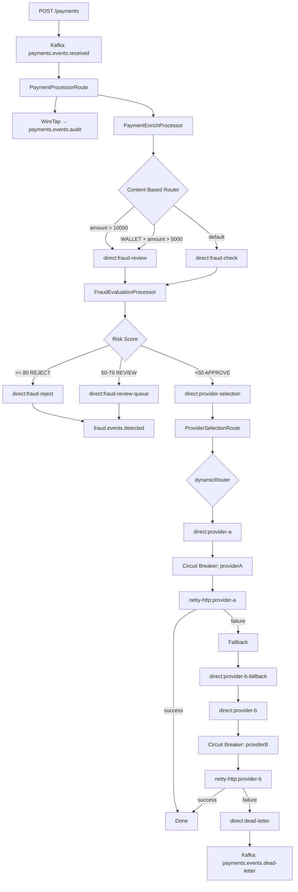
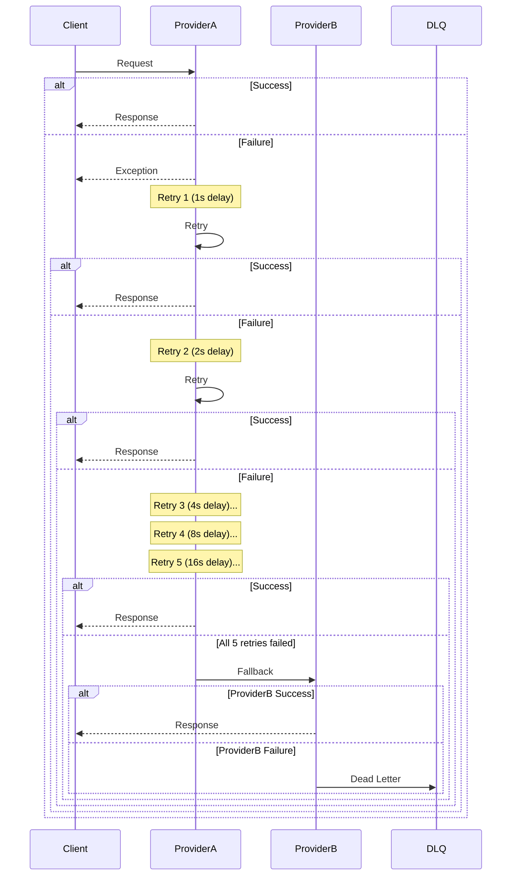

# Payment Orchestration Layer - POC

A spec-driven development (SDD) POC for a Payment Orchestration Layer built with Apache Camel, Quarkus, and Kubernetes.

## Prerequisites

| Tool | Version | Purpose |
|------|---------|---------|
| Ruby | 3.x | Rake automation |
| Podman | Latest | Container runtime |
| Kind | Latest | Kubernetes cluster |
| kubectl | Latest | K8s CLI |
| Maven | 3.9+ | Java build |
| Java | 17 LTS | Runtime |

## Quick Start

```bash
# Install dependencies
bundle install
npm install

# Setup services and cluster
rake sdd:setup

# List available changes
rake sdd:list
```

## SDD Workflow

### Initialize a Change
```bash
rake sdd:init[phase-1-foundation]
```

### Check Change Status
```bash
rake sdd:check[phase-1-foundation]
```

### Show Change Details
```bash
rake sdd:show[phase-1-foundation]
```

### Ship Change (requires all tasks complete)
```bash
rake sdd:ship[phase-1-foundation]
```

## Podman Services

```bash
# Start services
rake podman:up

# Check status
rake podman:ps

# View logs
rake podman:logs

# Stop services
rake podman:down
```

Services available:
- Kafka: localhost:9092
- Kafka UI: localhost:8088
- Prometheus: localhost:9090
- Jaeger: localhost:16686
- Grafana: localhost:3000 (admin/admin)

## Kubernetes

```bash
# Deploy to Kind
rake k8s:deploy

# Check pods
rake k8s:pods

# Port forward
rake k8s:port[payment-processor,8080]
```

## Specs Validation

```bash
# Validate all specs
rake spec:validate

# Generate code from OpenAPI
rake spec:codegen
```

## Project Structure

```
poc_camel/
├── Rakefile                    # SDD workflow tasks
├── Gemfile                    # Ruby dependencies
├── package.json               # Node tools
├── podman-compose.yaml        # Local services
├── config/
│   └── templates/change/      # SDD templates
├── specs/
│   ├── openapi/              # REST API specs
│   ├── asyncapi/             # Event specs
│   └── changes/             # Phase changes
├── kubernetes/               # K8s manifests
└── monitoring/              # Prometheus/Grafana
```

## Phases

| Phase | ID | Description |
|-------|-----|-------------|
| 1 | foundation | Infrastructure setup |
| 2 | api-layer | REST API implementation |
| 3 | camel-integration | Camel routes + EIP |
| 4 | k8s-observability | K8s deployment + monitoring |

## Technology Stack

- **Runtime**: Java 17 LTS (with Modern Features)
- **Framework**: Quarkus 3.x + Camel Quarkus
- **Message Broker**: Apache Kafka
- **Orchestration**: Kubernetes (Kind)
- **Observability**: Prometheus + Grafana + Jaeger
- **Spec-first**: OpenAPI 3.0 + AsyncAPI 3.0

## Java Standards

See [openspec/tech/java-modern.md](openspec/tech/java-modern.md) for mandatory modern Java features.

## Phase 3: Camel Integration - Fraud Rules

| Rule | Condition | Score | Description |
|------|-----------|-------|-------------|
| HIGH_AMOUNT | amount > 15000 | +50 | Large transaction amount |
| HIGH_RISK_COUNTRY | country in [XX, YY] | +30 | High-risk country code |
| RAPID_RETRY | attempts > 3 | +25 | Multiple retry attempts |
| NEW_PAYMENT_METHOD | method age < 30 days | +20 | New payment method for customer |
| UNUSUAL_HOUR | hour between 2-5 AM | +15 | Transaction at unusual time |

**Risk Score Actions:**
- **>= 80**: REJECT - Automatic rejection
- **50-79**: REVIEW - Manual review required
- **< 50**: APPROVE - Automatic approval

**Score Cap:** Maximum risk score capped at 100

## Phase 3: Camel Integration - Flow Diagrams

### Payment Processing Flow



### Circuit Breaker State Machine


### Retry with Exponential Backoff



## License

MIT